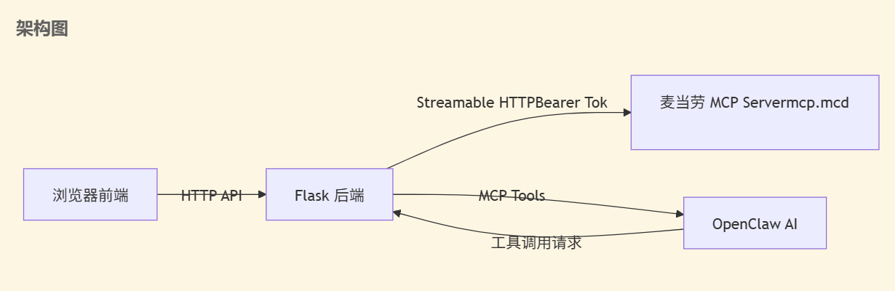
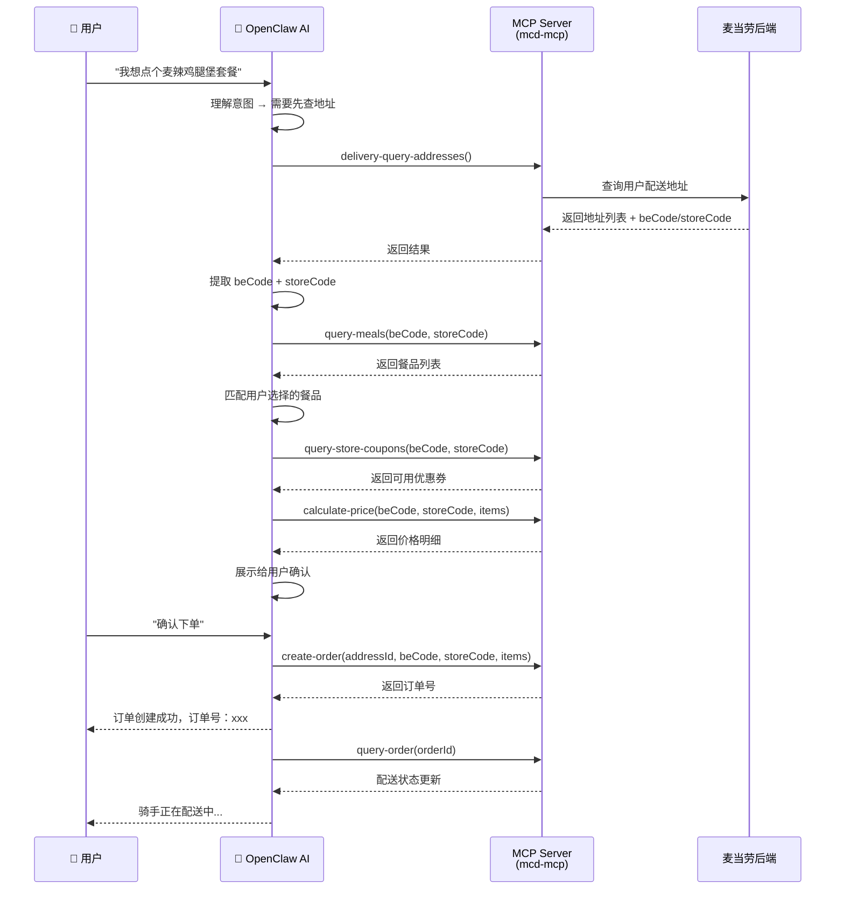
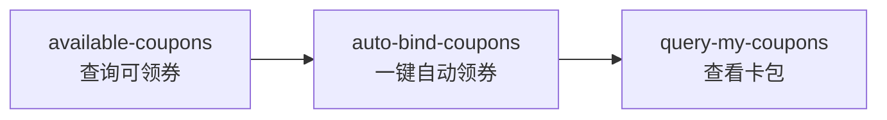
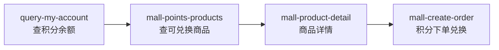
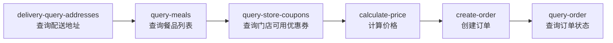

# 麦当劳 MCP 平台 — 架构与流程文档



### OpenClaw 交互时序图



---

## OpenClaw 命令行调用

### 完整点餐流程 curl 示例demo

```bash
# Step 1: 查询配送地址（获取 beCode + storeCode）
curl http://127.0.0.1:5000/api/tools/call \
  -H "Content-Type: application/json" \
  -d '{"name": "delivery-query-addresses", "arguments": {}}'

# Step 2: 用返回的 beCode + storeCode 查询门店餐品
curl http://127.0.0.1:5000/api/tools/call \
  -H "Content-Type: application/json" \
  -d '{"name": "query-meals", "arguments": {"storeCode": "S001", "beCode": "BE001"}}'

# Step 3: 查询门店可用优惠券
curl http://127.0.0.1:5000/api/tools/call \
  -H "Content-Type: application/json" \
  -d '{"name": "query-store-coupons", "arguments": {"storeCode": "S001", "beCode": "BE001"}}'

# Step 4: 计算价格（items 从 Step2 获取 productCode）
curl http://127.0.0.1:5000/api/tools/call \
  -H "Content-Type: application/json" \
  -d '{"name": "calculate-price", "arguments": {
    "storeCode": "S001",
    "beCode": "BE001",
    "items": [{"productCode": "10001", "quantity": 1}]
  }}'

# Step 5: 创建订单（addressId 从 Step1 获取）
curl http://127.0.0.1:5000/api/tools/call \
  -H "Content-Type: application/json" \
  -d '{"name": "create-order", "arguments": {
    "addressId": "12345",
    "storeCode": "S001",
    "beCode": "BE001",
    "items": [{"productCode": "10001", "quantity": 1}]
  }}'

# Step 6: 查询订单状态
curl http://127.0.0.1:5000/api/tools/call \
  -H "Content-Type: application/json" \
  -d '{"name": "query-order", "arguments": {"orderId": "1030938730000733964700499858"}}'
```

---

## 其他功能模块

### - 优惠券流程



### - 积分兑换流程



### - 下单流程



